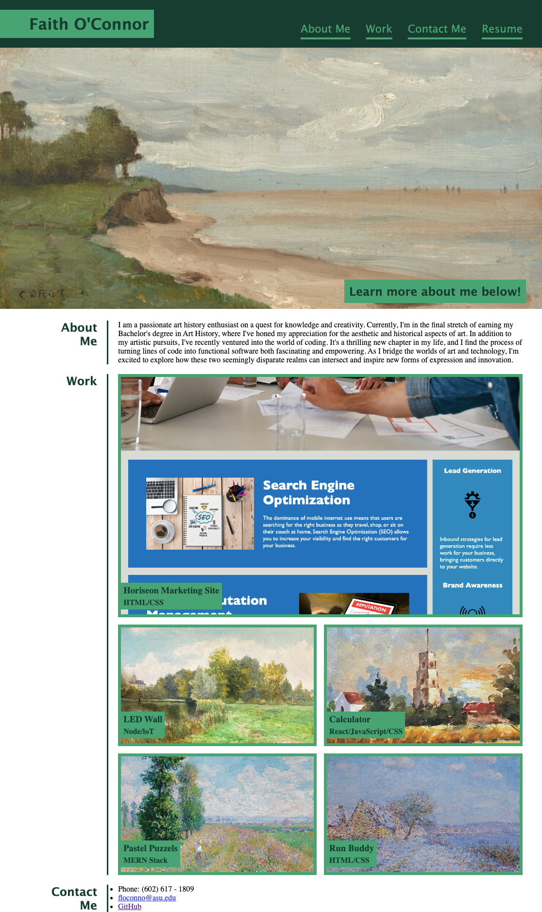

# Professional-Portfolio
This repository contains both an HTML and CSS file that work together to make up a professional portfolio. Within this portfolio is information about me, my projects, and my contact information. This portfolio will be useful to connect me with other developers and potential employers and showcase my coding experience and skills.

## Image of the site

## Link to deployed site
https://floconno.github.io/Professional-Portfolio/ 
